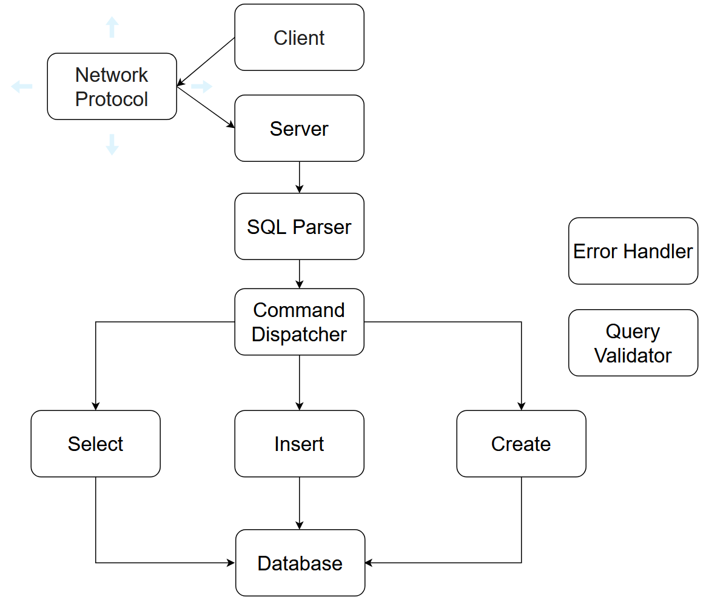

KodaSQL is a Relational Database Management System (RDBMS) in development, written in Rust. It sets up a tokio server and uses a custom network protocol that enables the client to interact with a csv-based database through a storage engine. The overall architecture is sketched in the following diagram, inspired by S. Pachev's excellent book [Understanding MySQL Internals](https://www.amazon.com/Understanding-MySQL-Internals-Discovering-Improving/dp/0596009577):

### Usage
1. Ensure you have Rust and `cargo` installed.
2. Fetch the repository and from the root run: `cargo build --release`, `cargo run --release`.
3. You can use the [basic_client](https://github.com/TudorOrban/KodaSQL/blob/main/examples/basic_client.rs) from examples to interact with your database from the CLI or build your own. Open a new terminal and run `cargo run --example basic_client`.

### Status
The project is in early stages and as such it has support for a limited range of SQL commands. However, the basic architecture is in place and adding new features will require minimal effort.